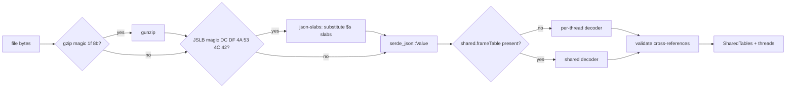

# Shared-tables profile format support

## Problem

pollard parses the Firefox processed-profile layout with per-thread tables, which samply 0.13.1 emits as `preprocessedProfileVersion` 49.
samply's main branch now emits version 75, where the string array and all frame, func, stack, resource, and native-symbol tables live in a profile-global `shared` section.
Loading such a file fails with `missing field stringArray`, and samply's default output is now the binary JSLB container (`profile.jslb.gz`), which pollard cannot read at all.
Both samply builds report version 0.13.1, so the break arrives silently with the next samply release.
This spec covers sub-project A: read both layouts, list the events a profile contains, and document the Linux perf workflow.

Sub-project B follows separately.
It adds per-sample and per-marker perf periods to samply output, records the main event name, and weights pollard percentages by period.
Nothing in this spec depends on B, and nothing here changes samply.

## Evidence

The findings below come from recording `perf record -e cycles,cache-misses,instructions,branch-misses -F 999 -g` on a shell loop and importing it with both samply builds.

* samply 0.13.1 writes version 49 with per-thread `stringArray`, and pollard loads it.
* samply main (`da48ff40`) writes version 75 with `shared`, and pollard rejects it.
* Samples-track and `Other event` marker counts match `perf script` for every event in both builds.
* The main event name (`cycles`) does not appear anywhere in either output.
* `-o foo.json.gz` produces plain gzipped JSON, and only `.jslb` or `.jslb.gz` produce JSLB (`samply/src/shared/save_profile.rs`).

The version 75 semantics below come from samply's writer in `fxprof-processed-profile/src/` at `da48ff40`.

## Goals

* Load version 49 through 55 per-thread profiles exactly as today.
* Load version 75 shared-layout profiles, as JSON or JSLB, gzipped or not.
* Symbolicate once per profile instead of once per thread.
* Report the events a profile contains in `describe_profile` and `summary`.
* Fix sub-process frames resolving their library against the root `libs` list.

## Non-goals

* Period weighting, the main event name, and any samply change (sub-project B).
* Versions between 56 and 74, unless tests confirm that the shared-layout decoder handles them.
* Changing how functions aggregate, which already keys on owned `(function, module)` strings.
* Fixing the existing behavior where the last frame of a func decides that func's symbolicated name and file.

## Internal model

A new `profile::tables` module holds one `SharedTables` per profile, and threads keep only their metadata, samples, and markers.
All indices in samples and markers point into `SharedTables`.
Columns are decoded into plain Rust types with `Option` for nullable values, so flag bits and zero sentinels never leave the decoder.
This matches where the format is heading and removes the per-thread copies of frames and strings.

`SharedTables` contains the following tables.

* `strings: Vec<String>` with a `HashMap<String, usize>` interning index.
* `frames`: `func`, `address: Option<u32>`, `lib: Option<usize>`, `line: Option<u32>`, `column: Option<u32>`, `native_symbol: Option<usize>`, `category`, `subcategory`, and `inlined: bool`.
* `funcs`: `name`, `is_js`, `relevant_for_js`, `resource: Option<usize>`, `file_name: Option<usize>`, `line_number: Option<u32>`, and `column_number: Option<u32>`.
* `stacks`: `frame` and `prefix: Option<usize>`, with the prefix absolute.
* `resources`: `name`, `host`, and `type`.
* `native_symbols`: `lib_index`, `address`, `name`, and `function_size: Option<u64>`.
* `libs: Vec<RawLib>`, one global list covering all processes.
* `inline_chains: Vec<Vec<InlineFrame>>`, parallel to `frames` and filled by symbolication.

The frame's `lib` column carries the library directly.
For per-thread input, the decoder fills it from `func.resource` and then `resource.lib`, so every consumer reads the library the same way.

## Loading

The loader picks the container by magic bytes instead of the file extension.
JSLB decoding uses the `json-slabs` crate, which replaces every `{"$s": N}` reference with the contents of slab N.
It then feeds the resulting JSON through the same decoder as plain JSON input.
The layout decision uses structure rather than the version number, and a version check follows it.

### Per-thread decoder

The per-thread decoder concatenates each thread's tables into the shared set.
It adds per-thread offsets to every cross-reference: stack to frame and prefix, frame to func and native symbol, func to name, resource, and file name, sample and marker stacks, and marker names.
Other marker payload fields stay untouched, because pollard reads only `type` and `cause.stack`.
Nested `processes[]` libraries merge into the global `libs` list with `resource.lib` remapped, which fixes the sub-process module bug.
The existing version 55 fixtures and the 28 inline JSON literals in test modules keep working unchanged, and they become the regression suite for this decoder.

### Shared decoder

The shared decoder maps version 75 columns according to samply's writer.

* `stackTable.prefixOffset` of 0 means a root, and any other value gives the parent `i - prefixOffset[i]`, which must be smaller than `i`.
* `frameTable.flags` bit 1 (`HAS_ADDRESS`) decides whether `address` and `lib` are set, bit 3 decides `nativeSymbol`, bit 4 decides `line`, bit 5 decides `column`, and bit 0 marks inlined frames.
* `funcTable.flags` bit 0 is `isJS`, bit 1 is `relevantForJS`, bit 2 decides `resource`, bit 3 decides `source`, bit 4 decides `lineNumber`, and bit 5 decides `columnNumber`.
* When `source` is set, the file name is `stringArray[sources.filename[source]]`.
* `frameTable.lib` indexes the top-level `libs` array.
* `nativeSymbols.functionSize` of -1 means unknown.
* `samples.stack` may contain `null`, `markers.name` and `data.cause.stack` are plain shared indices, and `startTime` and `endTime` hold 0 where the marker phase makes them meaningless.

Mapping `frameTable.lib` only when `HAS_ADDRESS` is set is an inference from the writer, which writes 0 for label frames.
The equivalence tests below verify it against real output.

### Validation

A validation pass after either decoder checks every cross-reference against its target table length.
A corrupt file then fails once at load with a precise error, instead of panicking later inside an accessor.

## Symbolication

Symbolication runs once over `SharedTables` rather than once per thread.
It collects native frames whose function name is empty or starts with `0x`, loads one symbol map per global library index, and looks up each frame address once.
String interning uses the `HashMap` index, which replaces the linear `position` scan in `symbolicate.rs`.
Writes keep today's granularity: name and file per func, line and inline chain per frame.

## Accessors and consumers

`frame_info`, `walk_stack`, and `inline_chain` in `parsed.rs` keep their signatures, including the thread handle, and read `SharedTables`.
`lib(idx)` indexes the merged global list.
The direct table readers move to the shared tables: `asm.rs` for library, native symbol, and size, `matching.rs` for iterating functions once, and `event.rs` together with `stack_indices` for resolving a marker name to a string index once per profile.
Test modules that mutate tables use small helpers on `SharedTables`, such as interning a string, pushing a resource, or setting an inline chain, instead of editing columns directly.
`transforms.rs` and the aggregators work on resolved strings and stay unchanged.

## Event discovery

`describe_profile` and `summary` gain an `events` list.
The samples track appears as `{name: "samples", source: "samples", count}`, because the file does not record the main event's name.
Each `Other event` marker name appears as `{name, source: "marker", count, stackless}`.
`RawMarkerData` starts reading the payload `type`, so only markers of type `Other event` count and `mmap` bookkeeping markers stay out of the list.
The existing unknown-event error takes its suggestions from this list.

## Documentation

The `profile-recording` skill documents recording with `perf record -e a,b,c -g` and importing with `samply import x.data -s -o x.json.gz`.
It states that the first `-e` event becomes the samples track and the others become markers named after the event.
It recommends `-c N` over `-F` when comparing counts across events, because frequency mode varies the period per sample and pollard counts samples without weights until sub-project B.
The skill also notes that `.jslb.gz` files load directly.
`pollard-doctor` documents `unsupported_format_version` and its fix, and the README and CHANGELOG describe the new format support.

## Errors

* `not_a_profile` reports which layer failed (gzip, JSLB container, JSON, or schema) and the position where it failed.
* `unsupported_format_version` reports the version found and the supported set when a shared-layout file carries an unverified version.
* Validation failures report the table, the column, the row, and the out-of-range index.

## Testing

* Shared decoder unit tests cover `prefixOffset` for roots, chains, and out-of-range offsets, each flag bit mapping to its `Option`, `source` to file name, and label frames with address 0 but no `HAS_ADDRESS`.
* Per-thread decoder tests cover two threads with overlapping indices receiving disjoint offsets, and sub-process library remapping as the regression test for the module bug.
* Equivalence tests import one `perf.data` recording with samply 0.13.1 (version 49) and samply main (version 75, as `.json.gz` and `.jslb.gz`).
  After symbolication, `top_functions`, `call_tree`, and `top_functions` with `event="cache-misses"` must return identical results for all three files.
* The existing suite passes unchanged apart from the table-mutation helpers.
* Fixtures come from a trivial shell workload, and only samply output is checked in, not `perf.data`.
  `meta.product` and `meta.oscpu` contain the recording host's name and kernel, so the fixture generator scrubs them before committing.

## Rollout

The work lands as one pollard pull request from the `shared-tables-format` branch.
The model switch, the per-thread decoder, and the symbolication port form a single commit, because every table consumer changes with the model and no smaller step builds.
The shared decoder, the JSLB container, event discovery, and documentation follow as separate commits.
