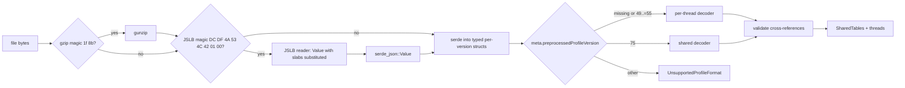

# Shared-tables profile format support

## Problem

pollard parses the Firefox processed-profile layout with per-thread tables, which samply 0.13.1 emits as `preprocessedProfileVersion` 49.
samply's main branch now emits version 75, where the string array and all frame, func, stack, resource, and native-symbol tables live in a profile-global `shared` section.
Loading such a file fails with `missing field stringArray`, and samply's default output is now the binary JSLB container (`profile.jslb.gz`), which pollard cannot read at all.
Both samply builds report version 0.13.1, so the break arrives silently with the next samply release.
This spec covers sub-project A: read both layouts, list the events a profile contains, and document the Linux perf workflow.

Sub-project B follows separately.
It adds per-sample and per-marker perf periods to samply output, records the main event name, and weights pollard percentages by period.
Nothing in this spec depends on B, and nothing here changes samply.

## Evidence

The findings below come from recording `perf record -e cycles,cache-misses,instructions,branch-misses -F 999 -g` on a shell loop and importing it with both samply builds.

* samply 0.13.1 writes version 49 with per-thread `stringArray`, and pollard loads it.
* samply main (`da48ff40`) writes version 75 with `shared`, and pollard rejects it.
* Samples-track and `Other event` marker counts match `perf script` for every event in both builds.
* The main event name (`cycles`) does not appear anywhere in either output.
* `-o foo.json.gz` produces plain gzipped JSON, and only `.jslb` or `.jslb.gz` produce JSLB (`samply/src/shared/save_profile.rs`).

The format rules below come from the Firefox Profiler's `docs-developer/CHANGELOG-formats.md`, which documents every processed-profile version, and from samply's writer in `fxprof-processed-profile/src/` at `da48ff40`.
The JSLB container follows `FORMAT.md` in `mstange/json-slabs` and the `json-slabs` 0.2 crate.

## Goals

* Load per-thread profiles (versions 49 through 55, or no version field) exactly as today.
* Load version 75 shared-layout profiles, as JSON or JSLB, gzipped or not.
* Symbolicate once per profile instead of once per thread.
* Report the events a profile contains in `describe_profile` and `summary`.
* Fix sub-process frames resolving their library against the root `libs` list.

## Non-goals

* Period weighting, the main event name, and any samply change (sub-project B).
* Versions 56 through 74 and versions above 75.
  No producer pollard targets emits them: samply 0.13.1 emits 49 and samply main emits 75.
  The changelog documents each intermediate step, so adding a version later means adding its rules and a fixture.
* Changing how functions aggregate, which already keys on owned `(function, module)` strings.
* Fixing the existing behavior where the last frame of a func decides that func's symbolicated name and file.
* Reading `sourceLocationTable`, `originalLocation`, `innerWindowID`, frame categories, or marker payload fields other than `type` and `cause.stack`.

## Internal model

A new `profile::tables` module holds one `SharedTables` per profile, and threads keep only their metadata, samples, and markers.
All indices in samples and markers point into `SharedTables`.
Columns are decoded into plain Rust types with `Option` for nullable values, so flag bits and sentinels never leave the decoder.
This matches where the format is heading and removes the per-thread copies of frames and strings.

`SharedTables` contains the following tables.

* `strings: Vec<String>` with a `HashMap<String, usize>` interning index.
* `frames`: `func`, `address: Option<u32>`, `lib: Option<usize>`, `line: Option<u32>`, `column: Option<u32>`, `native_symbol: Option<usize>`, and `inlined: bool`.
* `funcs`: `name`, `is_js`, `relevant_for_js`, `resource: Option<usize>`, `file_name: Option<usize>`, `line_number: Option<u32>`, and `column_number: Option<u32>`.
* `stacks`: `frame` and `prefix: Option<usize>`, with the prefix absolute.
* `resources`: `name`, `host: Option<usize>`, and `type`.
* `native_symbols`: `lib_index`, `address`, `name`, and `function_size: Option<u64>`.
* `libs: Vec<RawLib>`, one global list covering all processes.
* `inline_chains: Vec<Vec<InlineFrame>>`, parallel to `frames` and filled by symbolication.

The frame's `lib` column carries the library directly.
For per-thread input, the decoder fills it from `func.resource` and then `resource.lib`, so every consumer reads the library the same way.
Frame categories are dropped because no pollard consumer reads them.

Threads keep samples and markers in decoded form.
Samples keep today's `absolute_times` semantics, which accept either `time` (version 49) or `timeDeltas` (version 75).
Markers carry `start_time: Option<f64>` and `end_time: Option<f64>`, set according to `phase`: instant and interval-start markers have no end time, and interval-end markers have no start time.
The time-range filter in `stack_indices` uses the start time and falls back to the end time for interval-end markers.

## Loading

The loader picks the container by magic bytes instead of the file extension.
The JSLB magic is the 8 bytes `DC DF 4A 53 4C 42 01 00`, which include the container version.
A first pass reads only `meta.preprocessedProfileVersion` and picks the decoder, and a missing version counts as the per-thread layout because the hand-written test literals carry none.
Any other version returns the existing `ToolError::UnsupportedProfileFormat` with the version found.

### Memory

Plain JSON deserializes straight into typed per-version structs through serde, as `load.rs` does today, without building a `serde_json::Value` tree.
A `Value` tree for a large profile costs several times the file size, so only the JSLB path uses it.
There the root JSON skeleton is small because the columns live in binary slabs, and the substituted `Value` goes through `serde_json::from_value` into the same typed structs.
The version peek on plain JSON uses a small serde struct that ignores every field except `meta.preprocessedProfileVersion`, which costs a second parse of the file.

### JSLB reader

The `json-slabs` crate parses the container and exposes slabs, but leaves placeholder substitution to the consumer.
pollard therefore implements the substitution itself on top of `ParsedFile::parse`, `slab_at`, `read`, and `read_subjson_bytes`.
It parses the root JSON slab and replaces every `{"$s": N}` object with slab N.
A numeric slab becomes a JSON array of numbers, decoded by its slab type: `i8`, `u8`, `i16`, `u16`, `i32`, `u32`, `f32`, `f64`, `i64`, or `u64`.
A JSON slab is parsed and substituted recursively, which covers `threads` and `stringArray`.
samply's writer uses `u8` and `u16` for flags and subcategories, `u32` for frame addresses, `i32` for indices and line numbers, and `f64` for times.

### Per-thread decoder

The per-thread decoder concatenates each thread's tables into the shared set, adding per-thread offsets to every cross-reference.

* Strings: `funcTable.name`, `funcTable.fileName`, `resourceTable.name`, `resourceTable.host`, `nativeSymbols.name`, and `markers.name`.
* Frames: `stackTable.frame`.
* Stacks: `stackTable.prefix`, `samples.stack`, and `markers.data.cause.stack`.
* Funcs: `frameTable.func`.
* Resources: `funcTable.resource`.
* Native symbols: `frameTable.nativeSymbol`.
* Libraries: `resourceTable.lib` and `nativeSymbols.libIndex`, remapped from each process's `libs` into the global list.

Nested `processes[]` libraries merge into the global `libs` list, which fixes the sub-process module bug.
Marker payload fields other than `type` and `cause.stack` are not decoded, so string indices inside them, such as `data.name` on `mmap` markers, never reach pollard and cannot dangle.
The existing version 55 fixtures and the 28 inline JSON literals in test modules keep working unchanged, and they become the regression suite for this decoder.

### Shared decoder

The shared decoder maps version 75 columns according to the Firefox Profiler format changelog.

* `stackTable.prefixOffset` of 0 means a root, and any other value `k` gives the parent `i - k`, which must be smaller than `i` (version 66).
* `frameTable.flags` bit 1 (`HasAddress`) gates both `address` and `lib` (version 71), bit 3 gates `nativeSymbol`, bit 4 gates `line`, bit 5 gates `column`, and bit 0 marks inlined frames.
  Bit 2 (`HasCategory`) gates `category` and `subcategory`, which pollard ignores.
* `funcTable.flags` bit 0 is `IsJS`, bit 1 is `RelevantForJS`, bit 2 gates `resource`, bit 3 gates `source`, bit 4 gates `lineNumber`, and bit 5 gates `columnNumber` (version 75).
* When `source` is set, the file name is the string at `sources.filename[source]` (version 58).
* `frameTable.lib` indexes the top-level `libs` array (version 70).
* `nativeSymbols.functionSize` of -1 means unknown (version 74).
* `samples.stack` may contain `null`, and `markers.name` and `data.cause.stack` are plain shared indices.
* Marker `startTime` and `endTime` may hold 0 or `null` where the phase makes them meaningless (version 68), and the decoder turns them into `None`.

### Validation

A validation pass after either decoder checks every cross-reference against its target table length.
A corrupt file then fails once at load with a precise error, instead of panicking later inside an accessor.

## Symbolication

Symbolication runs once over `SharedTables` rather than once per thread.
It collects native frames whose function name is empty or starts with `0x`, and looks up each frame address once.
A profile-level symbol map cache keyed by global library index replaces today's per-thread `symbol_map_cache`, so each library loads once.
String interning uses the `HashMap` index, which replaces the linear `position` scan in `symbolicate.rs`.
Writes keep today's granularity: name and file per func, line and inline chain per frame.

## Accessors and consumers

`frame_info`, `walk_stack`, and `inline_chain` in `parsed.rs` keep their signatures, including the thread handle, and read `SharedTables`.
`lib(idx)` indexes the merged global list, and `all_libs()` returns that list.
The direct table readers move to the shared tables: `asm.rs` for library, native symbol, and size, `matching.rs` for iterating functions once, and `event.rs` together with `stack_indices` for resolving a marker name to a string index once per profile.
Consumers of `all_libs()`, including `address_to_function.rs` and `module_names`, keep working through the accessor.
`summary.rs`, `session.rs`, and `tools/lifecycle.rs` use only accessors and need no change beyond the new event list.
Test modules that mutate tables use small helpers on `SharedTables`, such as interning a string, pushing a resource, or setting an inline chain, instead of editing columns directly.
`transforms.rs` and the aggregators work on resolved strings and stay unchanged.

## Event discovery

`describe_profile` and `summary` gain an `events` list.
The samples track appears as `{name: "samples", source: "samples", count}`, because the file does not record the main event's name.
Each `Other event` marker name appears as `{name, source: "marker", count, stackless}`.
`RawMarkerData` starts reading the payload `type`, so only markers of type `Other event` count and `mmap` bookkeeping markers stay out of the list.
The existing unknown-event error takes its suggestions from this list.

## Documentation

The `profile-recording` skill documents recording with `perf record -e a,b,c -g` and importing with `samply import x.data -s -o x.json.gz`.
It states that the first `-e` event becomes the samples track and the others become markers named after the event.
It recommends `-c N` over `-F` when comparing counts across events, because frequency mode varies the period per sample and pollard counts samples without weights until sub-project B.
The skill also notes that `.jslb.gz` files load directly.
`pollard-doctor` documents `UnsupportedProfileFormat` and its fix, and the README and CHANGELOG describe the new format support.

## Errors

* `NotAProfile` reports which layer failed (gzip, JSLB container, JSON, or schema) and the position where it failed.
* `UnsupportedProfileFormat` reports the version found, and its message lists the supported versions.
* Validation failures report the table, the column, the row, and the out-of-range index as `NotAProfile`.

## Testing

* Shared decoder unit tests cover `prefixOffset` for roots, chains, and out-of-range offsets, each flag bit mapping to its `Option`, `source` to file name, label frames with address 0 but no `HasAddress`, and marker times per phase.
* JSLB reader unit tests cover each numeric slab type and a nested JSON slab.
* Per-thread decoder tests cover two threads with overlapping indices receiving disjoint offsets, and sub-process library remapping for both `resourceTable.lib` and `nativeSymbols.libIndex` as the regression test for the module bug.
* Version gating tests cover a missing version, 49, 55, 75, and rejection of 56, 74, and 76.
* Equivalence tests import one `perf.data` recording with samply main as `.json.gz` and `.jslb.gz`, and require identical `top_functions`, `call_tree`, and `top_functions` with `event="cache-misses"` results after symbolication.
* A cross-version test imports the same recording with samply 0.13.1 (version 49) and compares it to the version 75 import on per-event totals and the set of symbolicated function names.
  Strict equality does not hold across versions, because samply main also emits a `[kernel.kallsyms]` library and different category names.
* The existing suite passes unchanged apart from the table-mutation helpers.
* Fixtures come from a trivial shell workload, and only samply output is checked in, not `perf.data`.
  `meta.product` and `meta.oscpu` contain the recording host's name and kernel, so the fixture generator scrubs them before committing.

## Rollout

The work lands as one pollard pull request from the `shared-tables-format` branch.
The model switch, the per-thread decoder, and the symbolication port form a single commit, because every table consumer changes with the model and no smaller step builds.
The shared decoder, the JSLB reader, event discovery, and documentation follow as separate commits.
